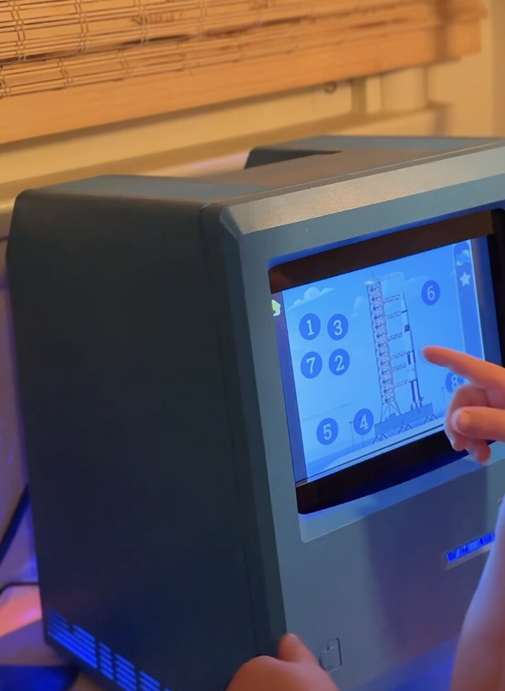
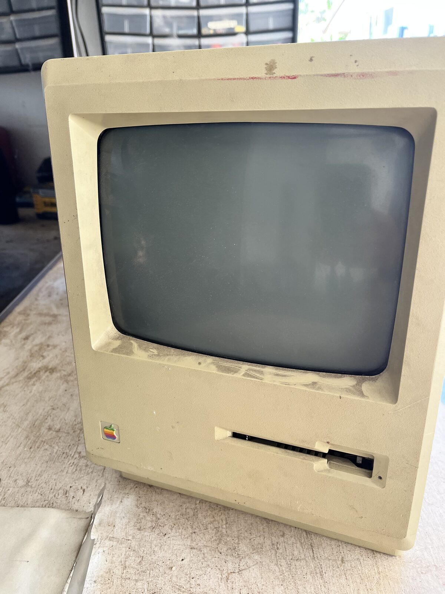
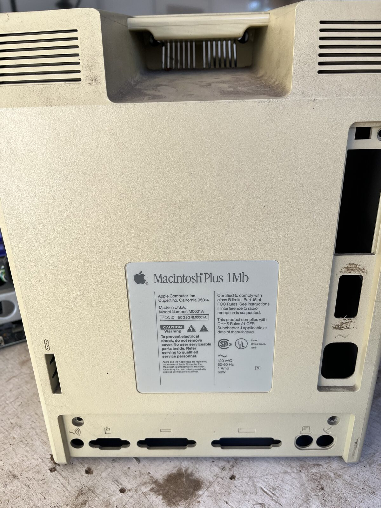
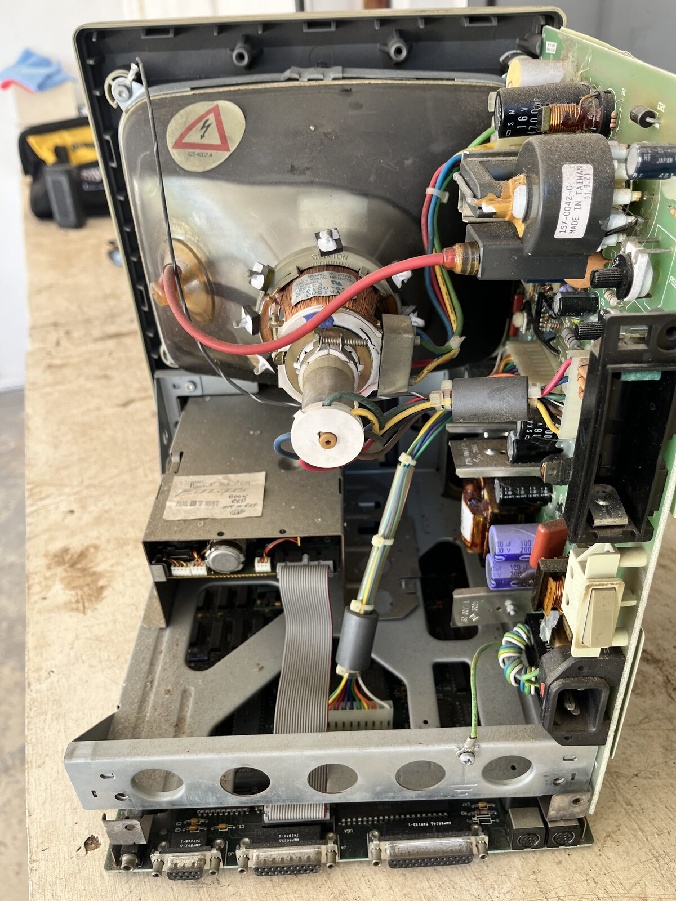
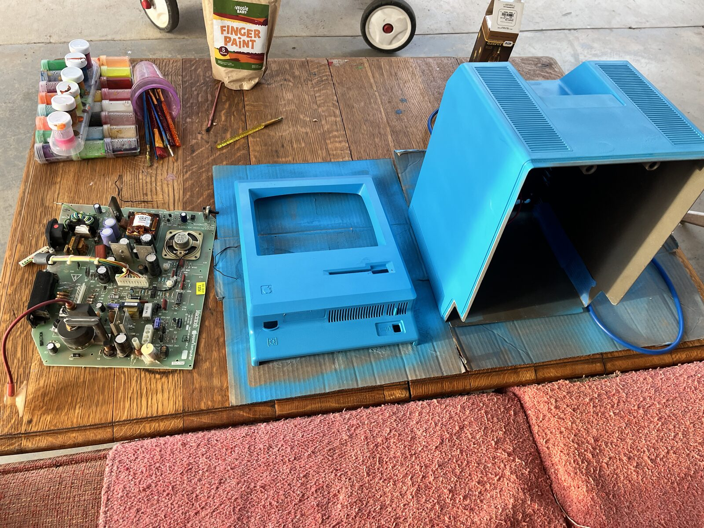
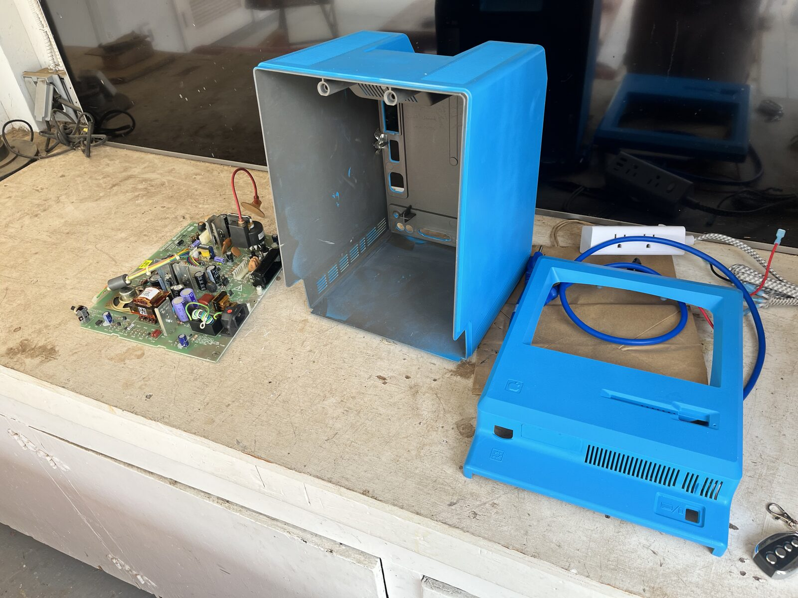
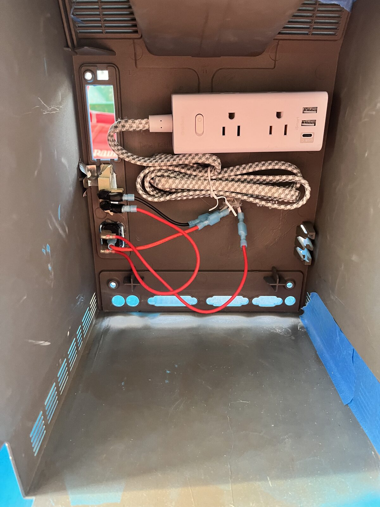
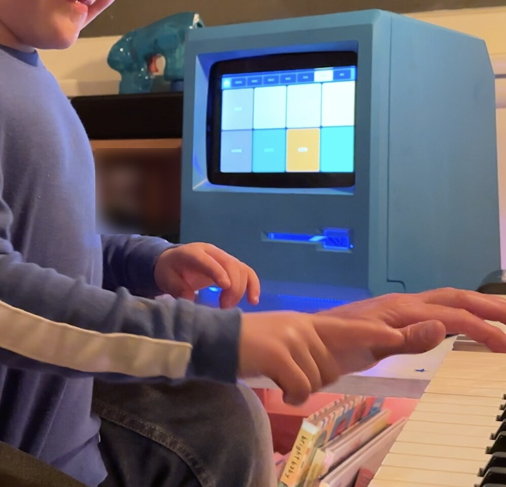

# mac-plus-ai-station

**A 1984 Macintosh Plus shell, gutted and rebuilt into a voice-driven AI station for my
six-year-old.** Weather, music, photos, and a talking assistant, behind the original
beige and the original bezel.



```console
$ system --info

  chassis ........ Macintosh Plus (1984) · original shell, gutted
  compute ........ Beelink SER8 · Ryzen 7 8845HS · 64GB · 2TB NVMe
  display ........ Waveshare 10.1" capacitive touch · 1280×800
  bezel .......... 3mm matte acrylic, laser-cut · 239 × 147mm aperture
  audio .......... USB desktop speakers + clip-on USB-C lavalier
  input .......... touch · voice · 8BitDo Ultimate 2C controller
  os ............. Linux · systemd-managed kiosk service
```

---

## Why

I wanted my son to have a computer that felt like *an object* rather than a rectangle of
glass, something with a shape, a weight, and a history. The Mac Plus was the machine
that taught a generation what a personal computer was. Putting a voice assistant inside
one felt like the right kind of joke.

The constraint made it interesting. A Mac Plus has an internal volume designed around a
9" CRT and a floppy mechanism. Everything modern had to fit that envelope without
cutting the shell.

---

## The donor




A real Macintosh Plus 1Mb, model M0001A, made in the USA. Yellowed, scuffed, and dead.
Worth saying plainly: **this one did not work and was not going to.** I would not gut a
running Plus, and if yours runs, don't.

---

## Teardown



Everything comes out: CRT, analog board, power supply, floppy mechanism, logic board.

⚠️ **A CRT holds a lethal charge long after it is unplugged.** The anode cap on that tube
can still kill you weeks later. If you have not discharged one before, read up properly
first, or find someone who has.

---

## Paint




He picked the colour. That was the whole selection process.

---

## The hard part was millimeters, not software

The Waveshare panel's body is 239 × 147mm. The Mac Plus front aperture leaves **under
1mm of tolerance** on the width. There is no adjusting after the fact. The bezel either
lands or the whole faceplate reads as wrong.

```console
$ fit --check

  panel body ............. 239.0 × 147.0 mm
  shell aperture ......... 239.x × 147.x mm
  clearance .............. < 1.0 mm  ← no margin for error
  verdict ................ test-fit physically before committing to a cut
```

Mounting is M3 nylon standoffs, 3M VHB, and right-angle brackets where the shell's
internal posts allowed. The acrylic bezel sits *behind* the shell so the original front
face stays untouched.

---

## Power routing



The display needs 12V DC for the panel and USB for touch. That is two cables into a
chassis with one hole. Speakers plus mic on the same bus will brown out an unpowered
hub, so everything runs off one low-profile strip mounted to the rear wall.

---

## What went wrong (kept, because it's the useful part)

**STL modification failed.** The plan was to model the bezel in 3D and print it.
OpenSCAD's boolean operations wouldn't initialize against the imported shell mesh, and I
lost time trying to force it.

**Pivoted to 2D vector fabrication.** A laser-cut acrylic sheet does the same job with a
fraction of the complexity. Simpler process, more reliable vendor pipeline, better
finish. The 3D approach was solving a problem I didn't actually have.

**Vendors want DXF, not raw SVG.** Raw SVGs arrived corrupted. Send compressed or DXF.

**Check fill and stroke before export.** The vendor's preview showed cut paths reversed:
an Illustrator fill/stroke issue that would have cut the aperture as the keep and the
frame as the waste. Caught it in preview, not in acrylic.

---

## Finished



It lives on the piano now, which was not the plan and is better than the plan.

---

## Layout

```console
$ tree -L 1

  assets/ ................ build photos, reference images, cut files
  project_management/ .... plan, progress, risk log, design notes
  scripts/ ............... environment setup, service install, UI launch
  systemd/ ............... kiosk service unit
  ui/ .................... three UI spikes: kivy, electron, pyqt
```

`ui/` holds three parallel attempts at the interface. They're kept rather than deleted
because the comparison is the point: Kivy handled touch well but fought the aesthetic,
Electron was the fastest to make *look* right, PyQt sat between them.

---

## Notes

- All network addresses and hostnames in this repo are documentation placeholders.
- Photos are stripped of EXIF metadata.

---

## License

MIT.
